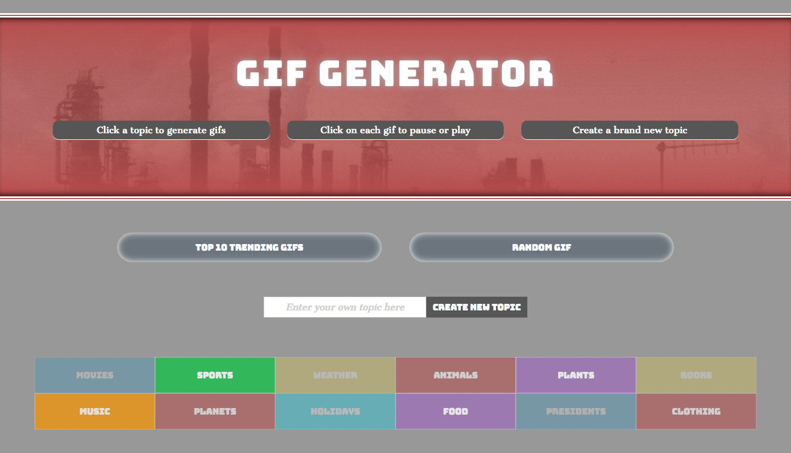

# Gif Generator

__This application utilizes the GIPHY API to allow users to generate gifs based on a specified topic.__ 

#### Overview:
* The application initially provides pre-built buttons with topics for the user to use.
* When the user clicks on a topic, the page grabs 10 gif images related to that topic. Each gif image will stop or resume playing upon the user's click. The page also provides a "Load More" button to allow users to retrieve more gifs from the chosen topic.
* Users also have the opportunity to create their own button to generate gifs from topics of their choosing.
  * Users can enter their topic into the field input and upon clicking submit, the application will add the user-created topic to the existing group of topics.
* If the user clicks the _"Top 10 Trending Gifs"_ button, the app will return the top 10 trending gifs from the Giphy API.
* Every time the user clicks the _"Random Gif"_ button, the app will return a single random gif.

#### > __Click Below to Try it Out:__

